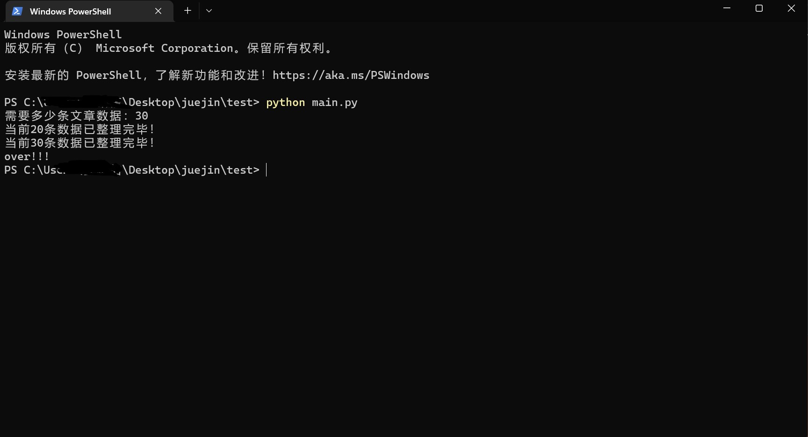
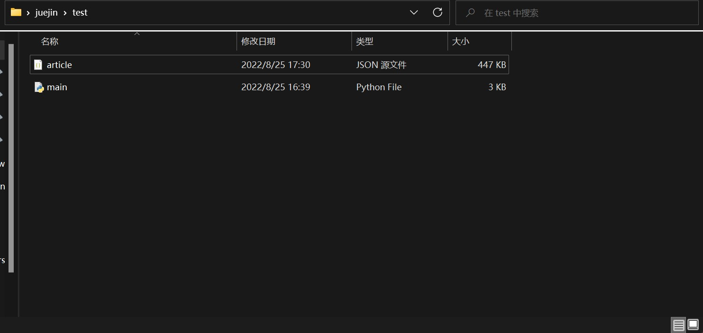
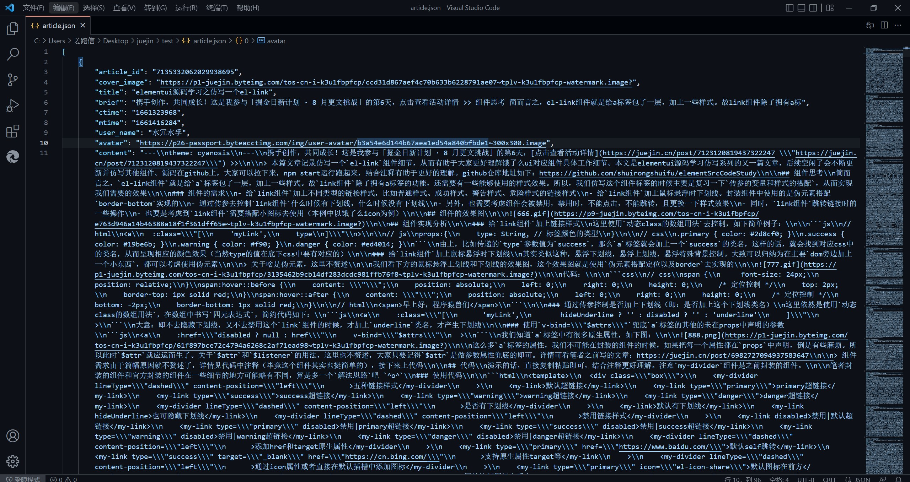

<!--
 * @Description: 请填写文件简介
 * @Version: 0.0
 * @Autor: jlx
 * @Date: 2022-08-25 16:43:49
 * @LastEditors: jlx
 * @LastEditTime: 2022-08-26 08:04:40
-->
## 掘金项目文章爬取源码介绍

### 需要的项目环境

1.  python3.6 及以上版本
2.  requests， BeautifulSoup4 两个库


python3安装教学（从网上随便找的一个）：https://blog.csdn.net/qq_53280175/article/details/121107748

如果安装包下载速度较慢，可以搜一下python 安装包国内镜像


在配置好python 环境变量之后，通过cmd命令框或者powershell执行以下命令来安装这两个库

requests（一个网络请求库）

> pip install requests

BeautifulSoup 用来解析html的dom结构来获取其中的数据

> pip install beautifulsoup4

### 项目运行

如果不下载编译器的情况下，可以直接使用 powershell 或cmd 编译py 文件

如果下载编译器例如pycharm， vscode之类的，直接点右键编译并执行main.py 文件即可


这里测试，直接使用的powershell 执行一下**main.py** 文件：




生成的文件位置：



文件预览：



### 后续扩展

如果想要更多的文章相关字段可以参考下方api的返回值：

https://api.juejin.cn/recommend_api/v1/article/recommend_all_feed

请求类型：post

请求传参示例：

```json
{"id_type": 2, "client_type": 2608, "sort_type": 200, "cursor": "0", "limit": 20}
```

返回参数根据自己需要来修改代码即可